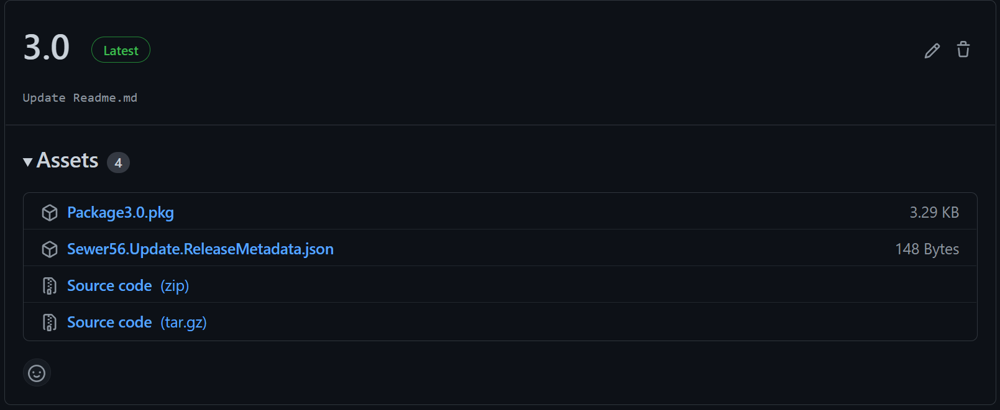

## GitHub Release Resolver

[Found In: `Sewer56.Update.Resolvers.GitHub`]  

The `GitHub Release Resolver` reads releases from a given repository's Releases section.

### Example Usage

```csharp
// Use GitHub Package Resolver with a specified Repo as Config
var resolver = new GitHubReleaseResolver(new GitHubResolverConfiguration()
{
    UserName       = "Sewer56", 
    RepositoryName = "Update.Test.Repo"
});

var versions = await resolver.GetPackageVersionsAsync();
await resolver.DownloadPackageAsync(versions[0], packageFilePath, new ReleaseMetadataVerificationInfo() { FolderPath = this.OutputFolder });
```

### About this Implementation

Example Repository: <https://github.com/Sewer56/Update.Test.Repo/releases>



This implementation fetches releases by using the GitHub API, and has two modes of operation, one which uses versions from the release tag (default) and one which uses the files uploaded in the latest GitHub Release.

#### Version from Tag (Default)

Use case: When there is only 1 package/download per repository.  

In this mode, tags are used to denote release versions.  
If you tag your release with 1.1, the returned version will be 1.1.  

Releases should consist of only the packages with the same version as the tag they are under.  
If you have a release with version 1.1, you should only include the following packages in the release:  

- Regular (Copy) Package with Version 1.1  
- Delta Package from $(PreviousVersion) to 1.1 [Optional]  

#### Version from Metadata File

Use case: When there are multiple packages/downloads per repository.  

This one works like all the other resolvers. Simply upload all of the files to the latest release (or pre-release).  

### Caching

This implementation in particular uses some very aggressive API call saving tactics to avoid hitting the 
rate limit (60 per hour per IP!!), at the expense of bringing in additional dependencies.

#### Response Caching

This implementation uses Conditional Requests (ETags) to cache responses from the GitHub API such that they [don't count against the rate limit](https://docs.github.com/en/rest/overview/resources-in-the-rest-api#conditional-requests).  

Specifically it uses the [CacheCow](https://github.com/aliostad/CacheCow) library to provide support for RFC 7230 and RFC 2616 HTTP caching headers in conjunction with [Akavache](https://github.com/reactiveui/Akavache), used to provide the backing storage for cached items.

More specifically, a map of all received ETags to their respective responses is stored in a local SQLite3.X database. 
This database is...   
- Located in `$"AppData/Local/Sewer56.Update.Resolvers.GitHub/Cache.db"` (or your platform equivalent).  
- Shared between all library instances.  
- Thread safe.  

Items have an expiration date of 30 days. 